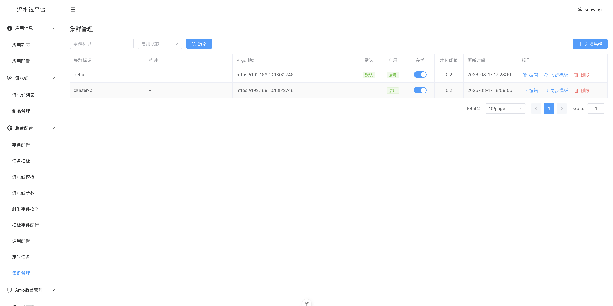
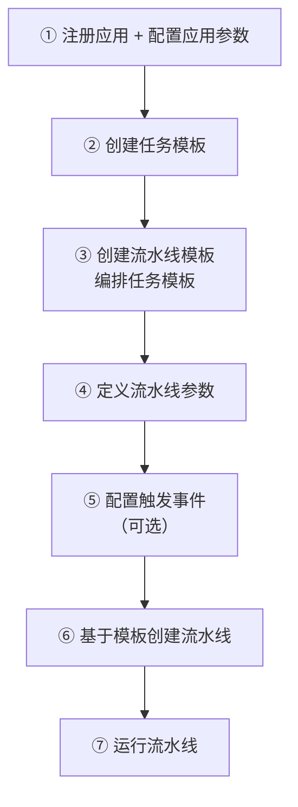

# 用户手册

本手册详细介绍流水线平台前端的各项功能及操作流程。

---

## 目录

- [1. 登录](#1-登录)
- [2. 应用管理](#2-应用管理)
  - [2.1 应用列表](#21-应用列表)
  - [2.2 应用配置](#22-应用配置)
- [3. 后台配置](#3-后台配置)
  - [3.1 字典配置](#31-字典配置)
  - [3.2 任务模板](#32-任务模板)
  - [3.3 流水线模板](#33-流水线模板)
  - [3.4 流水线参数](#34-流水线参数)
  - [3.5 触发事件枚举](#35-触发事件枚举)
  - [3.6 模板事件配置](#36-模板事件配置)
  - [3.7 通用配置](#37-通用配置)
  - [3.8 定时任务](#38-定时任务)
  - [3.9 集群管理](#39-集群管理)
- [4. 流水线](#4-流水线)
  - [4.1 流水线列表](#41-流水线列表)
  - [4.2 流水线运行](#42-流水线运行)
  - [4.3 运行历史](#43-运行历史)
  - [4.4 触发历史](#44-触发历史)
  - [4.5 制品管理](#45-制品管理)
- [5. 开发一条流水线](#5-开发一条流水线)

---

## 1. 登录

打开系统后，首先进入登录页面。输入账号信息完成登录。这里随便输入一个字符串，比如：admin、zhangsan等等。

登录成功后自动跳转到应用列表页面。未登录状态下访问任何页面都会被重定向到登录页。

---

## 2. 应用管理

应用是流水线平台的核心概念，每条流水线、制品等都归属于某个应用。

### 2.1 应用列表

**菜单路径**：应用信息 → 应用列表

应用列表展示当前所有已注册的应用，是进入各功能模块的入口。

**操作说明**：

- **选择应用**：点击列表中的应用，系统会记住当前选中的应用，后续进入流水线列表、制品管理等页面时会自动携带该应用上下文。

---

### 2.2 应用配置

**菜单路径**：应用信息 → 应用配置

应用配置用于管理应用级别的参数和设置，如 Git 仓库信息、构建配置等。

**操作说明**：

- 选择左侧的应用，右侧展示该应用的配置项。
- 修改配置后点击「保存」。

---

## 3. 后台配置

后台配置模块用于管理流水线平台的基础数据和模板。

### 3.1 字典配置

**菜单路径**：后台配置 → 字典配置

字典配置用于维护系统中的枚举值和下拉选项数据。

**操作说明**：

- **字典类型列表**：展示所有字典分类。
- **查看字典数据**：点击某个字典类型，进入字典数据管理页面，可增删改该类型下的具体选项。

---

### 3.2 任务模板

**菜单路径**：后台配置 → 任务模板

任务模板是流水线中可复用的最小执行单元，定义了一个具体步骤的执行逻辑（如代码拉取、编译构建、镜像推送等）。

**操作说明**：

- **新增任务模板**：点击「新增」按钮，填写模板编码、名称、模板内容（YAML 格式）等信息。
- **版本管理**：点击「版本管理」可查看模板的历史版本。

---

### 3.3 流水线模板

**菜单路径**：后台配置 → 流水线模板

流水线模板是预定义的流水线编排结构，可由多个任务模板组合而成，用于快速创建结构相似的流水线。

**操作说明**：

- **新增流水线模板**：点击「新增」按钮，定义模板的编排结构。
- **版本管理**：点击「版本管理」查看模板的历史版本。

---

### 3.4 流水线参数

**菜单路径**：后台配置 → 流水线参数

流水线参数用于管理流水线运行时可传入的参数定义（如环境变量、构建参数等）。

**操作说明**：

- **新增参数**：点击「新增」按钮，进入参数创建页面，定义参数名称、类型、默认值等。
- **查看详情**：点击参数名称查看详细信息。

### 3.5 触发事件枚举

**菜单路径**：后台配置 → 触发事件枚举

触发事件枚举定义了流水线支持的所有触发事件类型（如代码推送、手动触发、定时触发等）。

---

### 3.6 模板事件配置

**菜单路径**：后台配置 → 模板事件配置

模板事件配置用于将流水线模板与触发事件进行绑定，实现事件驱动的自动化流水线执行。

**操作说明**：

- **新增绑定**：选择流水线模板和触发事件，建立绑定关系。
- 当对应事件发生时，系统会自动触发绑定的流水线模板。

---

### 3.7 通用配置

**菜单路径**：后台配置 → 通用配置

通用配置用于管理系统级别的键值对配置，支持配置版本历史追溯。

**操作说明**：

- **新增配置**：以键值对形式添加系统配置。
- **查看历史**：点击「历史」查看某个配置项的修改记录。

---

### 3.8 定时任务

**菜单路径**：后台配置 → 定时任务

定时任务用于管理 CronJob。

**操作说明**：

- **新增定时任务**：配置 Cron 表达式和关联的java bean、方法、参数。
- **查看执行日志**：进入「定时任务日志」页面，查看定时任务的触发记录和执行日志。

---

### 3.9 集群管理

**菜单路径**：后台配置 → 集群管理

集群管理用于维护平台所对接的 Kubernetes 集群信息。

**操作说明**：

- **新增集群**：点击「新增」按钮，填写集群名称、API Server 地址、认证凭证等信息。

Argo Token是：Bearer xxx，的形式，K8s Token则仅需要填：xxx，不需要Bearer 前缀

- **编辑集群**：修改集群的连接配置。
- **连通性测试**：验证平台与集群的网络连通性及权限是否正常。

---

## 4. 流水线

流水线模块是系统的核心功能，提供流水线的创建、运行、监控和管理能力。

### 4.1 流水线列表

**菜单路径**：流水线 → 流水线列表

流水线列表以应用为维度展示所有流水线，支持查看、编辑、运行等操作。

**操作说明**：

- **选择应用**：页面顶部下拉选择应用，列表会过滤出该应用下的流水线。
- **新增流水线**：点击「新增」按钮，选择流水线模板，填写流水线信息。
- **运行流水线**：点击「运行」按钮，手动触发流水线执行。
- **查看运行**：点击「最近运行」或「运行历史」进入流水线运行详情。

---

### 4.2 流水线运行

**菜单路径**：流水线列表 → 最近运行

流水线运行页面以 DAG 画布形式展示流水线的执行状态，每个节点代表一个任务步骤。

**操作说明**：

- **DAG 画布**：可视化展示流水线各步骤的执行状态（成功 / 失败 / 运行中 / 未执行），支持拖拽、缩放。
- **节点详情**：点击某个节点，查看该步骤的详细执行信息。
- **节点日志**：在节点详情中查看实时日志输出（基于 xterm.js 终端组件）。

---

### 4.3 运行历史

**菜单路径**：流水线列表 → 运行历史

运行历史以分页列表形式展示流水线的所有执行记录。

**操作说明**：

- 每条记录展示执行状态、开始时间、耗时等信息。
- 点击某条记录可查看该次执行的 DAG 画布详情。

---

### 4.4 触发历史

**菜单路径**：流水线 → 触发历史（侧栏菜单未直接展示，通过流水线列表进入）

触发历史展示流水线的触发记录，支持按流水线 ID 或应用名称维度查询。

---

### 4.5 制品管理

**菜单路径**：流水线 → 制品管理

制品管理用于查看和管理流水线产出的构建制品（如 Docker 镜像、JAR 包等）。

**操作说明**：

- 制品列表按应用维度展示，支持按应用名称筛选。
- 每条制品记录关联产生该制品的流水线运行记录。

---

## 5. 开发一条流水线

本节以从零开发一条完整的 CI/CD 流水线为例，介绍在平台上需要完成的全链路操作步骤。

> **与清单仓库的区别**：`pipeline-manifests` 仓库通过 `kubectl apply` 直接部署 YAML 清单来管理模板；而在平台上，所有模板的创建、版本管理和编排都通过 Web 界面完成，并且平台额外提供了参数管理、事件触发、应用配置等能力。

### 整体流程

### ① 注册应用并配置应用参数

**菜单路径**：应用信息 → 应用列表 → 应用配置

1. 在「应用列表」页面确认应用已注册（应用通常由管理员预先创建）。
2. 点击应用进入「应用配置」页面，填写应用的基础信息：
   - **应用名称**：如 `go-web-demo`
   - **Git SSH URL**：代码仓库地址
   - **编程语言**：决定可选的流水线模板（如 Go、Java）
3. 切换环境 Tab，配置该应用在各环境下的默认参数（如构建上下文目录等），这些参数在运行流水线时会自动填充。

### ② 创建任务模板

**菜单路径**：后台配置 → 任务模板

任务模板是流水线中最小的可复用执行单元，对应一个原子化的 CI/CD 步骤。

1. 点击「新增」，填写模板编码（如 `git-sync`）、名称、分组和描述。
2. 进入「版本管理」页面：
   - 填写版本号（语义化版本，如 `1.0.0`）。
   - 在模板详情编辑器中编写 YAML 内容（定义容器的镜像、命令、输入输出参数等）。
   - 点击「保存草稿」，确认无误后点击「发布」使其生效。
3. 一条完整的 CI/CD 流水线通常需要创建以下任务模板：
   - **代码同步**（如 `git-sync`）：拉取代码并生成版本元数据
   - **编译构建**（如 `go-build`）：编译源码生成制品
   - **镜像构建**（如 `go-build-image`）：打包运行镜像
   - **制品推送**（如 `push-image-nexus3`）：推送镜像/制品到仓库
   - **部署**（如 `go-k8s-deploy-via-api`）：部署到 K8s

### ③ 创建流水线模板

**菜单路径**：后台配置 → 流水线模板

流水线模板将多个任务模板以 DAG 方式编排成完整的流水线。

1. 点击「新增」，填写模板编码（如 `go-cicd-pipeline`）、名称、分组和描述。
2. 进入「版本管理」页面：
   - 在模板详情编辑器中编写 YAML，通过 `templateRef` 引用任务模板，用 `depends` 定义 DAG 依赖关系。
   - 可切换到 **DAG 预览模式**，可视化查看编排结构是否正确。
   - 保存时，系统会自动检查模板中引用了哪些参数，如果存在**未定义的参数**，会弹框提示，可点击直接跳转到参数创建页面。
3. 发布版本使其生效。

### ④ 定义流水线参数

**菜单路径**：后台配置 → 流水线参数

流水线参数定义了运行流水线时需要用户填写的入参（如 Git 分支、环境、镜像名等）。

1. 点击「新增」，进入参数创建页面。
2. 填写参数定义：
   - **参数名 / 中文名称**：如 `git-branch` / 「Git 分支」
   - **参数类型**：系统参数（自动处理）或用户参数（用户填写）
   - **组件类型**：input、select、radio、git-tree（GitLab 仓库目录树选择）等
   - **参数组别 / 排序**：控制参数在执行弹框中的分组和展示顺序
   - **默认值 / 正则校验 / 是否必填**
   - **依赖参数**：实现级联显示（如选择某环境后才显示特定参数）
   - **值变动刷新**：参数值变化时自动刷新下游参数选项
3. 如果在第 ③ 步中通过未定义参数提示跳转过来，参数名会自动预填。

### ⑤ 配置触发事件（可选）

**菜单路径**：后台配置 → 触发事件枚举 → 模板事件配置

如果希望流水线支持外部系统自动触发（如代码推送、提测事件等），需要完成事件绑定。

1. 在「触发事件枚举」中确认事件类型已定义（如「效能平台提测」）。
2. 在「模板事件配置」中新增绑定：选择触发事件 + 流水线模板，建立映射关系。
3. 绑定后，外部系统触发对应事件时，平台会自动使用绑定的模板创建并执行流水线。

> 如果仅手动触发流水线，可跳过此步骤。

### ⑥ 基于模板创建流水线

**菜单路径**：流水线 → 流水线列表

1. 在顶部下拉选择目标应用。
2. 点击「新建流水线」，系统会根据应用的编程语言过滤出可用的流水线模板，以卡片画廊形式展示（含 DAG 缩略预览）。
3. 选择模板，填写流水线名称，点击确认创建。

### ⑦ 运行流水线

**菜单路径**：流水线列表 → 执行

1. 在流水线列表中点击「执行」按钮，弹出参数填写弹框。
2. 系统会根据参数定义动态渲染表单（按组别展示，支持级联和联动刷新），应用配置中的默认值会自动填充。
3. 填写完成后点击「执行」，系统提交到 Argo Workflows 引擎运行。
4. 自动跳转到流水线运行详情页，以 DAG 画布实时展示各节点执行状态，点击节点可查看详细日志。
