# 用户手册

本手册详细介绍流水线平台前端的各项功能及操作流程。

---

## 目录

- [1. 登录](#1-登录)
- [2. 应用管理](#2-应用管理)
  - [2.1 应用列表](#21-应用列表)
  - [2.2 应用配置](#22-应用配置)
- [3. 后台配置](#3-后台配置)
  - [3.1 字典配置](#31-字典配置)
  - [3.2 任务模板](#32-任务模板)
  - [3.3 流水线模板](#33-流水线模板)
  - [3.4 流水线参数](#34-流水线参数)
  - [3.5 触发事件枚举](#35-触发事件枚举)
  - [3.6 模板事件配置](#36-模板事件配置)
  - [3.7 通用配置](#37-通用配置)
  - [3.8 定时任务](#38-定时任务)
- [4. 流水线](#4-流水线)
  - [4.1 流水线列表](#41-流水线列表)
  - [4.2 流水线运行](#42-流水线运行)
  - [4.3 运行历史](#43-运行历史)
  - [4.4 触发历史](#44-触发历史)
  - [4.5 制品管理](#45-制品管理)

---

## 1. 登录

打开系统后，首先进入登录页面。输入账号信息完成登录。这里随便输入一个字符串，比如：admin、zhangsan等等。

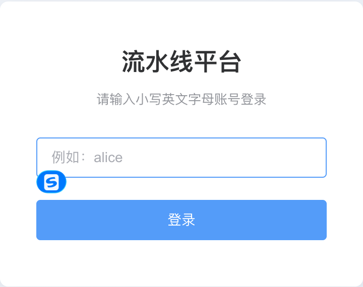

登录成功后自动跳转到应用列表页面。未登录状态下访问任何页面都会被重定向到登录页。

---

## 2. 应用管理

应用是流水线平台的核心概念，每条流水线、制品等都归属于某个应用。

### 2.1 应用列表

**菜单路径**：应用信息 → 应用列表

应用列表展示当前所有已注册的应用，是进入各功能模块的入口。

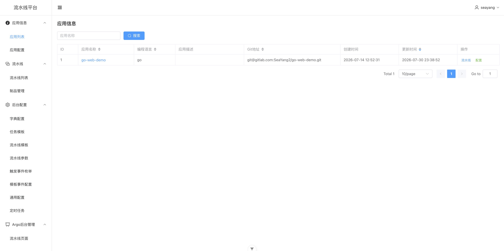

**操作说明**：

- **选择应用**：点击列表中的应用，系统会记住当前选中的应用，后续进入流水线列表、制品管理等页面时会自动携带该应用上下文。

---

### 2.2 应用配置

**菜单路径**：应用信息 → 应用配置

应用配置用于管理应用级别的参数和设置，如 Git 仓库信息、构建配置等。

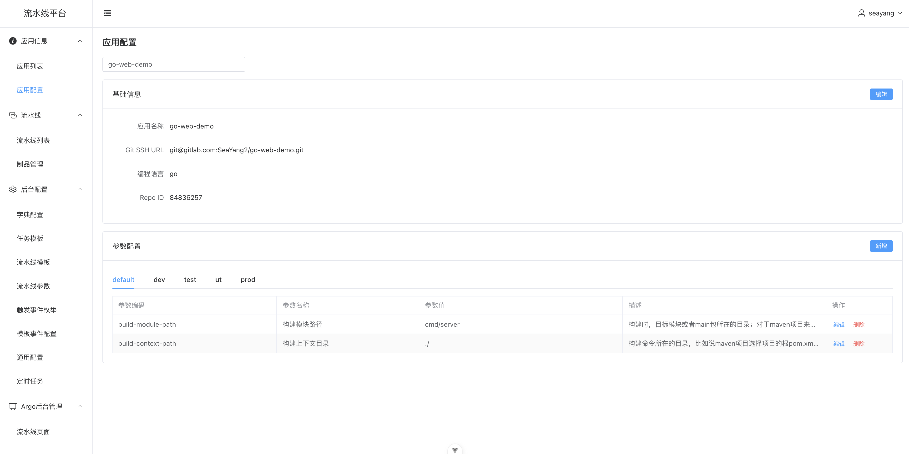

**操作说明**：

- 选择左侧的应用，右侧展示该应用的配置项。
- 修改配置后点击「保存」。

---

## 3. 后台配置

后台配置模块用于管理流水线平台的基础数据和模板。

### 3.1 字典配置

**菜单路径**：后台配置 → 字典配置

字典配置用于维护系统中的枚举值和下拉选项数据。

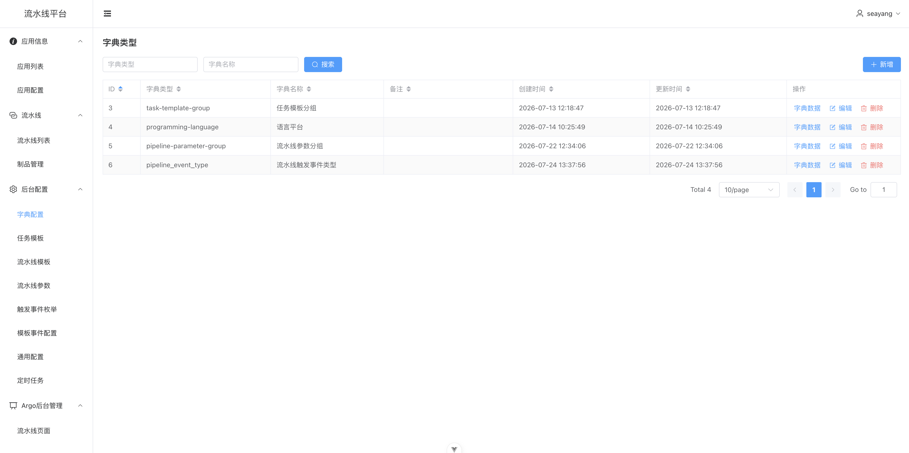

**操作说明**：

- **字典类型列表**：展示所有字典分类。
- **查看字典数据**：点击某个字典类型，进入字典数据管理页面，可增删改该类型下的具体选项。

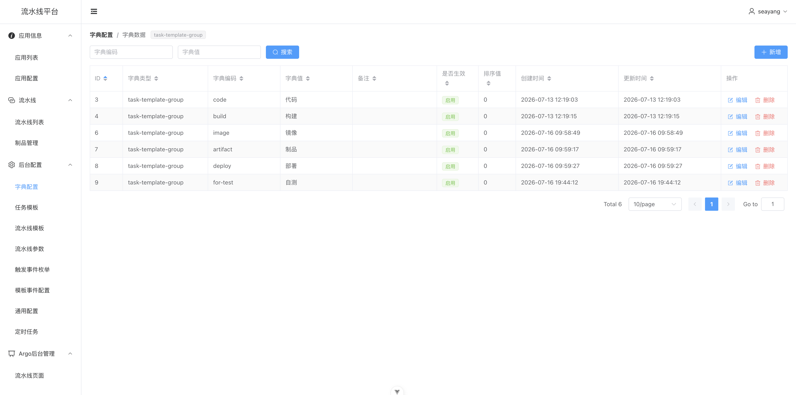

---

### 3.2 任务模板

**菜单路径**：后台配置 → 任务模板

任务模板是流水线中可复用的最小执行单元，定义了一个具体步骤的执行逻辑（如代码拉取、编译构建、镜像推送等）。

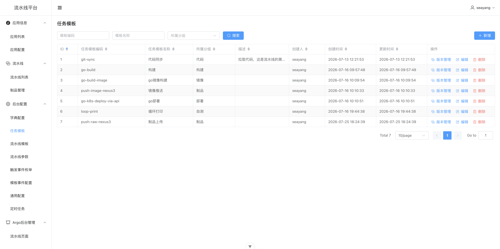

**操作说明**：

- **新增任务模板**：点击「新增」按钮，填写模板编码、名称、模板内容（YAML 格式）等信息。
- **版本管理**：点击「版本管理」可查看模板的历史版本。

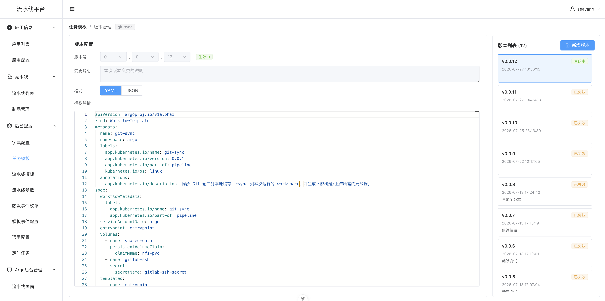

---

### 3.3 流水线模板

**菜单路径**：后台配置 → 流水线模板

流水线模板是预定义的流水线编排结构，可由多个任务模板组合而成，用于快速创建结构相似的流水线。

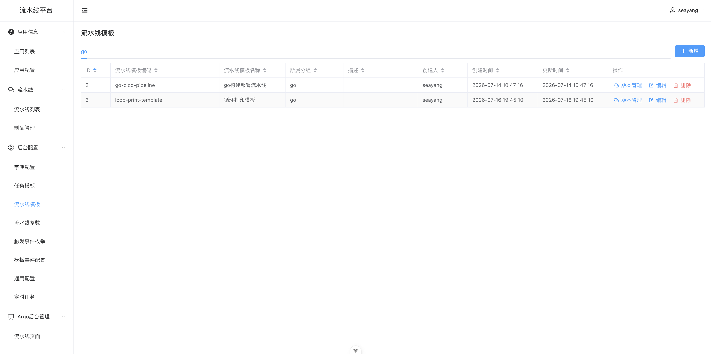

**操作说明**：

- **新增流水线模板**：点击「新增」按钮，定义模板的编排结构。
- **版本管理**：点击「版本管理」查看模板的历史版本。

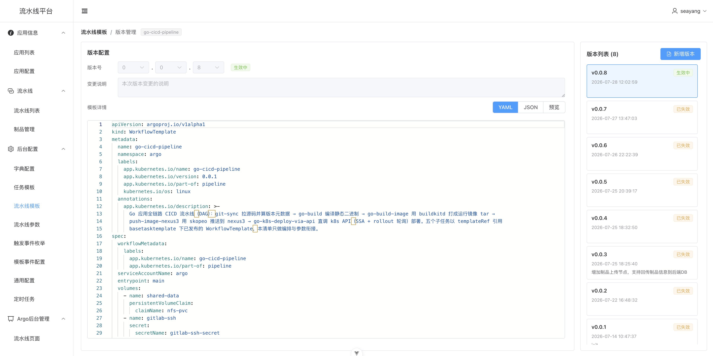

---

### 3.4 流水线参数

**菜单路径**：后台配置 → 流水线参数

流水线参数用于管理流水线运行时可传入的参数定义（如环境变量、构建参数等）。

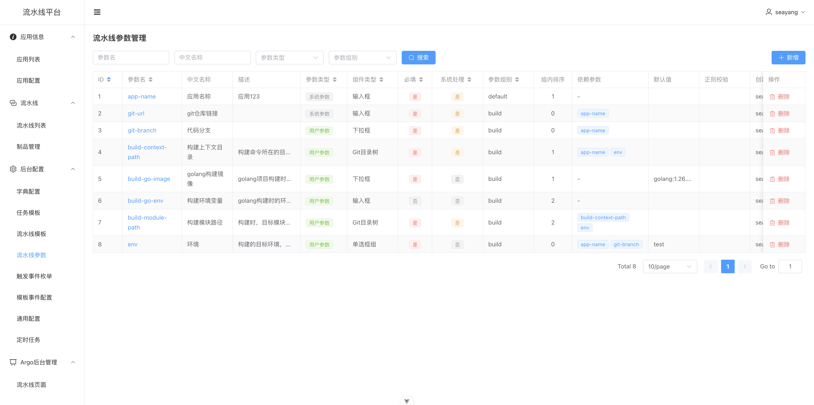

**操作说明**：

- **新增参数**：点击「新增」按钮，进入参数创建页面，定义参数名称、类型、默认值等。
- **查看详情**：点击参数名称查看详细信息。

### 3.5 触发事件枚举

**菜单路径**：后台配置 → 触发事件枚举

触发事件枚举定义了流水线支持的所有触发事件类型（如代码推送、手动触发、定时触发等）。

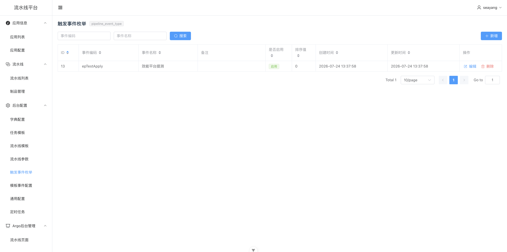

---

### 3.6 模板事件配置

**菜单路径**：后台配置 → 模板事件配置

模板事件配置用于将流水线模板与触发事件进行绑定，实现事件驱动的自动化流水线执行。

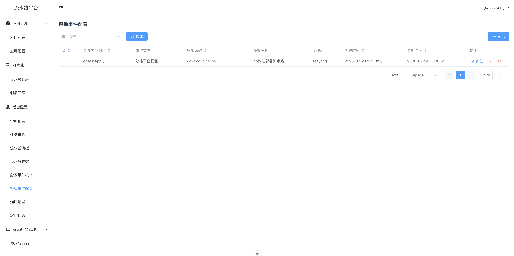

**操作说明**：

- **新增绑定**：选择流水线模板和触发事件，建立绑定关系。
- 当对应事件发生时，系统会自动触发绑定的流水线模板。

---

### 3.7 通用配置

**菜单路径**：后台配置 → 通用配置

通用配置用于管理系统级别的键值对配置，支持配置版本历史追溯。

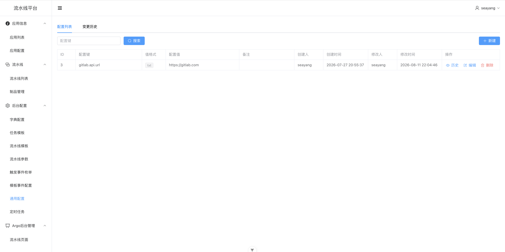

**操作说明**：

- **新增配置**：以键值对形式添加系统配置。
- **查看历史**：点击「历史」查看某个配置项的修改记录。

---

### 3.8 定时任务

**菜单路径**：后台配置 → 定时任务

定时任务用于管理 CronJob。

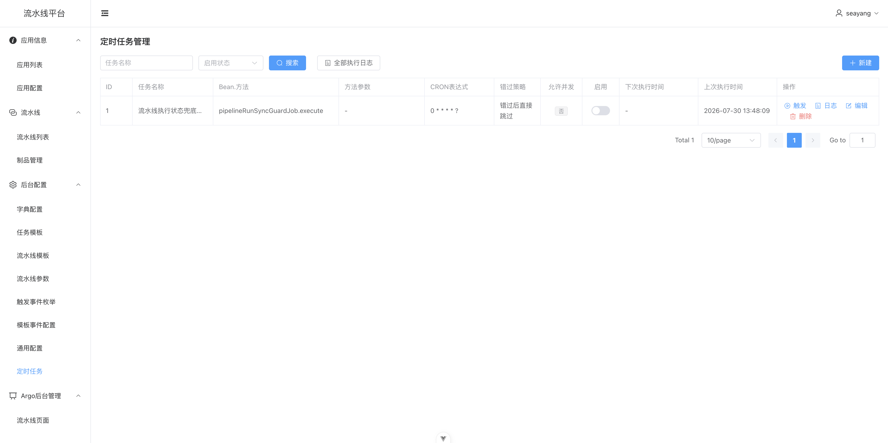

**操作说明**：

- **新增定时任务**：配置 Cron 表达式和关联的java bean、方法、参数。
- **查看执行日志**：进入「定时任务日志」页面，查看定时任务的触发记录和执行日志。

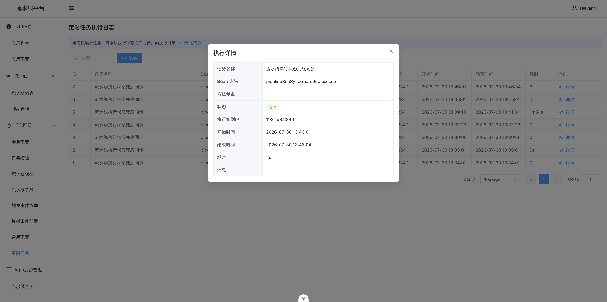

---

## 4. 流水线

流水线模块是系统的核心功能，提供流水线的创建、运行、监控和管理能力。

### 4.1 流水线列表

**菜单路径**：流水线 → 流水线列表

流水线列表以应用为维度展示所有流水线，支持查看、编辑、运行等操作。

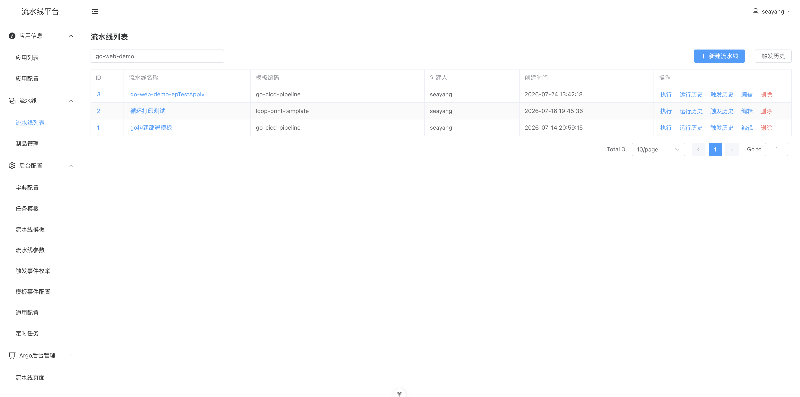

**操作说明**：

- **选择应用**：页面顶部下拉选择应用，列表会过滤出该应用下的流水线。
- **新增流水线**：点击「新增」按钮，选择流水线模板，填写流水线信息。
- **运行流水线**：点击「运行」按钮，手动触发流水线执行。
- **查看运行**：点击「最近运行」或「运行历史」进入流水线运行详情。

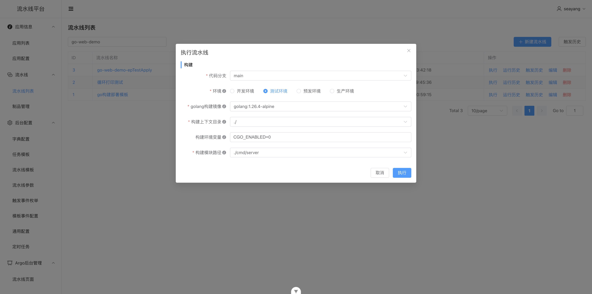

---

### 4.2 流水线运行

**菜单路径**：流水线列表 → 最近运行

流水线运行页面以 DAG 画布形式展示流水线的执行状态，每个节点代表一个任务步骤。

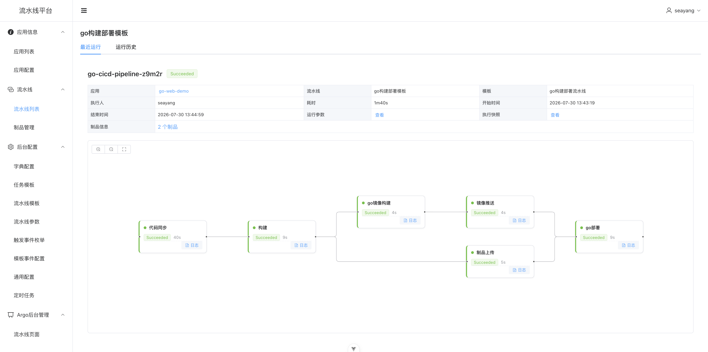

**操作说明**：

- **DAG 画布**：可视化展示流水线各步骤的执行状态（成功 / 失败 / 运行中 / 未执行），支持拖拽、缩放。
- **节点详情**：点击某个节点，查看该步骤的详细执行信息。
- **节点日志**：在节点详情中查看实时日志输出（基于 xterm.js 终端组件）。

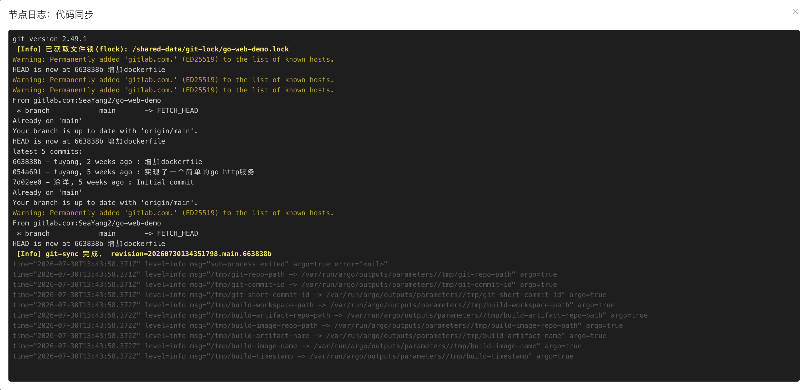

---

### 4.3 运行历史

**菜单路径**：流水线列表 → 运行历史

运行历史以分页列表形式展示流水线的所有执行记录。

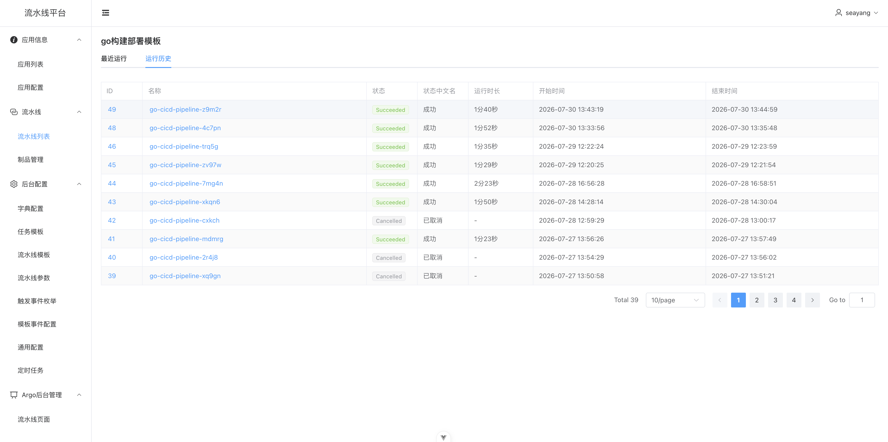

**操作说明**：

- 每条记录展示执行状态、开始时间、耗时等信息。
- 点击某条记录可查看该次执行的 DAG 画布详情。

---

### 4.4 触发历史

**菜单路径**：流水线 → 触发历史（侧栏菜单未直接展示，通过流水线列表进入）

触发历史展示流水线的触发记录，支持按流水线 ID 或应用名称维度查询。

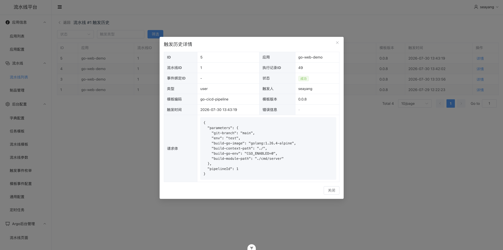

---

### 4.5 制品管理

**菜单路径**：流水线 → 制品管理

制品管理用于查看和管理流水线产出的构建制品（如 Docker 镜像、JAR 包等）。

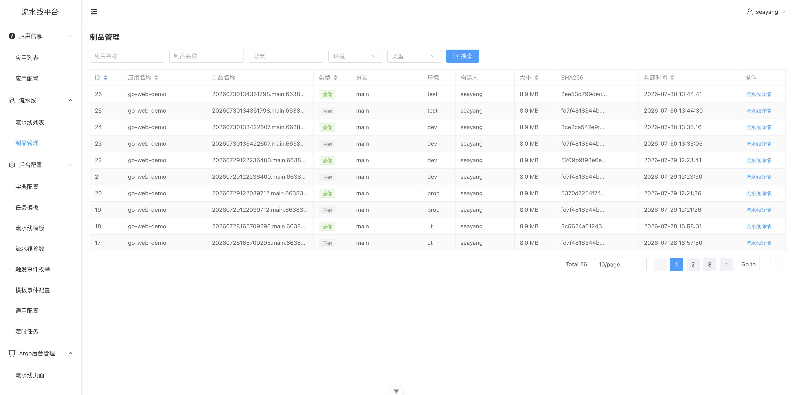

**操作说明**：

- 制品列表按应用维度展示，支持按应用名称筛选。
- 每条制品记录关联产生该制品的流水线运行记录。
